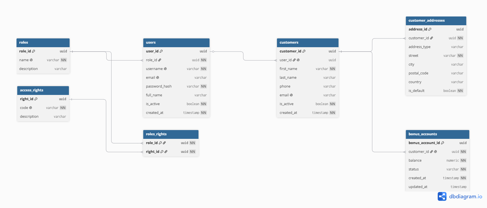

# Task 03 — Database Design

Частина командного проєкту **Restaurant Management System** (Variant 3, Hard) —
SoftServe Academy, Database Course, **Team-05**.

> **Це завдання Task 03 (Database Design)** — тут лише дизайн схеми (ER-діаграма).

**Block author:** Vitalii Alokhin ([@Essenthial](https://github.com/Essenthial))

---

## Table of Contents
- [Module Overview](#module-overview)
- [Contribution Note](#contribution-note)
- [MVP / Final Scope](#mvp--final-scope)
- [ER Diagram](#er-diagram)
- [Tables Description](#tables-description)
- [Relationships & Cardinality](#relationships--cardinality)
- [Data Types](#data-types)
- [Design Decisions](#design-decisions)

---

## Module Overview

Мій внесок — це два модулі: керування доступом (RBAC) та клієнти (CRM).

| Submodule | Tables | Purpose |
|---|---|---|
| **RBAC** — Ідентифікація та доступ | `roles`, `access_rights`, `users`, `roles_rights` | Хто входить у систему і що йому дозволено (керування доступом на основі ролей) |
| **CRM** — RCM / Покупці | `customers`, `customer_addresses`, `bonus_accounts` | Клієнти, їхні адреси та бонусні рахунки |

Усього **7 таблиць**.

---

## Contribution Note

| Contributor | Modules / Tables |
|---|---|
| **Vitalii Alokhin** (@Essenthial) | **Модуль 1** — Ідентифікація та доступ: `users`, `roles`, `access_rights`, `roles_rights` · **Модуль 2** — CRM: `customers`, `customer_addresses`, `bonus_accounts` |

---

## MVP / Final Scope

Згідно з варіантом, **MVP-рівень** покриває лише базові сутності: локації, персонал,
меню, замовлення, простий склад. **Усі 7 таблиць мого модуля належать до
`FINAL VERSION` (Enhanced Learning):**

- **RBAC** (керування доступом) — це «data validation & integrity checks» з опису
  Final-версії; у базовому MVP системи прав доступу немає.
- **CRM** — «Customer information» у варіанті вказана як **Final-поле**; адреси та
  бонусні рахунки — це розширений CRM понад базовий рівень.

---

## ER Diagram

---

## Tables Description

Позначення: **PK** — первинний ключ, **FK** — зовнішній ключ, **UQ** — унікальне,
**NN** — NOT NULL (обов'язкове), **DEF** — значення за замовчуванням.

### 1. `roles` — ролі доступу
Довідник ролей: набір прав під однією назвою (admin, manager, cashier). Роль визначає
**що користувач може робити в застосунку**, а не посаду працівника.

| Column | Type | Constraints | Description |
|---|---|---|---|
| `role_id` | `uuid` | PK, DEF `gen_random_uuid()` | Ідентифікатор ролі |
| `name` | `varchar(50)` | NN, UQ | Назва ролі (admin / manager / cashier) |
| `description` | `varchar(255)` | — | Опис ролі |

### 2. `access_rights` — права доступу
Атомарні дозволи — одна конкретна дія в системі.

| Column | Type | Constraints | Description |
|---|---|---|---|
| `right_id` | `uuid` | PK, DEF `gen_random_uuid()` | Ідентифікатор права |
| `code` | `varchar(80)` | NN, UQ | Машинний код права (напр. `orders.create`) |
| `description` | `varchar(255)` | — | Опис права |

### 3. `users` — користувачі
Облікові записи для входу. Один користувач має одну роль.

| Column | Type | Constraints | Description |
|---|---|---|---|
| `user_id` | `uuid` | PK, DEF `gen_random_uuid()` | Ідентифікатор користувача |
| `role_id` | `uuid` | NN, FK → `roles` | Роль користувача (його права) |
| `username` | `varchar(50)` | NN, UQ | Логін |
| `email` | `varchar(120)` | UQ | **Облікова** пошта (для входу) |
| `password_hash` | `varchar(255)` | NN | **Хеш** пароля (bcrypt/argon2), не сам пароль |
| `full_name` | `varchar(120)` | — | Повне ім'я |
| `is_active` | `boolean` | NN, DEF `true` | Чи активний обліковий запис |
| `created_at` | `timestamp` | NN, DEF `now()` | Момент створення |

### 4. `roles_rights` — зв'язок «роль ↔ право» (junction, M:N)
Які саме права входять у роль.

| Column | Type | Constraints | Description |
|---|---|---|---|
| `role_id` | `uuid` | PK, FK → `roles` | Роль |
| `right_id` | `uuid` | PK, FK → `access_rights` | Право |

Первинний ключ **складений** `(role_id, right_id)` — забороняє дублювати пару. Це забезпечується унікальністю композитного ключа та використанням зовнішніх ключів.

### 5. `customers` — клієнти

| Колонка | Тип | Обмеження | Опис |
|---|---|---|---|
| `customer_id` | `uuid` | PK, DEF `gen_random_uuid()` | Ідентифікатор клієнта |
| `user_id` | `uuid` | UQ, FK → `users` | Опційна прив'язка до логіна (0..1) |
| `first_name` | `varchar(80)` | NN | Ім'я |
| `last_name` | `varchar(80)` | — | Прізвище |
| `phone` | `varchar(30)` | — | Телефон (навмисно не UQ) |
| `email` | `varchar(120)` | UQ | **Контактна** пошта (для замовлень/доставки) |
| `is_active` | `boolean` | NN, DEF `true` | Чи активний клієнт |
| `created_at` | `timestamp` | NN, DEF `now()` | Момент реєстрації |

### 6. `customer_addresses` — адреси клієнтів
У клієнта може бути кілька адрес (доставка, робота, дім).

| Column | Type | Constraints | Description |
|---|---|---|---|
| `address_id` | `uuid` | PK, DEF `gen_random_uuid()` | Ідентифікатор адреси |
| `customer_id` | `uuid` | NN, FK → `customers` | Власник адреси |
| `address_type` | `varchar(20)` | CHECK: shipping / work / home | Тип адреси |
| `street` | `varchar(150)` | NN | Вулиця, будинок |
| `city` | `varchar(100)` | — | Місто |
| `postal_code` | `varchar(20)` | — | Індекс |
| `country` | `varchar(80)` | — | Країна |
| `is_default` | `boolean` | NN, DEF `false` | Адреса за замовчуванням (лише одна на клієнта) |

### 7. `bonus_accounts` — бонусні рахунки
Один бонусний рахунок на клієнта (1:1).

| Column | Type | Constraints | Description |
|---|---|---|---|
| `bonus_account_id` | `uuid` | PK, DEF `gen_random_uuid()` | Ідентифікатор рахунку |
| `customer_id` | `uuid` | NN, UQ, FK → `customers` | Власник (UQ → 1:1) |
| `balance` | `numeric(12,2)` | NN, DEF `0`, CHECK `>= 0` | Баланс балів |
| `status` | `varchar(20)` | NN, DEF `active`, CHECK: active/frozen/closed | Статус рахунку |
| `created_at` | `timestamp` | NN, DEF `now()` | Момент відкриття |
| `updated_at` | `timestamp` | — | Момент останнього оновлення |

---

## Relationships & Cardinality

| Child Table | FK Column | Parent Table | Cardinality | Implementation |
|---|---|---|---|---|
| `users` | `role_id` | `roles` | **1:N** (один-багато) | звичайний FK |
| `roles_rights` | `role_id` | `roles` | **M:N** | junction |
| `roles_rights` | `right_id` | `access_rights` | **M:N** | junction |
| `customers` | `user_id` | `users` | **0..1** | FK + UNIQUE + nullable |
| `customer_addresses` | `customer_id` | `customers` | **1:N** | звичайний FK |
| `bonus_accounts` | `customer_id` | `customers` | **1:1** | FK + UNIQUE |

---

## Data Types

| Type | Usage | Example Field |
|---|---|---|
| `uuid` | Унікальний ідентифікатор (128-біт), `gen_random_uuid()` | усі `*_id` |
| `varchar(n)` | Рядок обмеженої довжини | `name`, `email`, `street` |
| `numeric(12,2)` | Точне число з дробом (гроші/бали) | `balance` |
| `boolean` | `true` / `false` (прапорець) | `is_active`, `is_default` |
| `timestamp` | Дата **і** час разом | `created_at`, `updated_at` |

---

## Design Decisions

- **Ролі ≠ посади.** `roles` — це ролі *доступу* (права в застосунку), а не посади
  працівників. Посади розташовані у таблиці "ПОСАДИ ПРАЦІВНИКІВ" (модуль «Персонал»). Відповідальна — [@Mariia5palamariuk](https://github.com/Mariia5palamariuk).
- **Пароль як хеш.** У `users.password_hash` — лише хеш, ніколи відкритий пароль.
- **Два різні `email`.** `users.email` — облікова пошта (для входу), `customers.email` —
  контактна (для замовлень). Це не дублювання: незареєстрований клієнт (зв'язок 0..1)
  не має запису в `users`, тож контакт треба зберігати в `customers`.
- **Бонуси окремою таблицею.** Замість простого поля `loyalty_points` — повноцінна
  таблиця `bonus_accounts` (баланс, статус, історія), зв'язок 1:1.
- **Одна адреса за замовчуванням.** Частковий унікальний індекс не дає зробити
  дефолтними дві адреси одного клієнта.
- **Телефон не унікальний.** Один номер може належати кільком клієнтам (родина,
  корпоративний). Ідентифікатор клієнта — `customer_id`, а не телефон.

